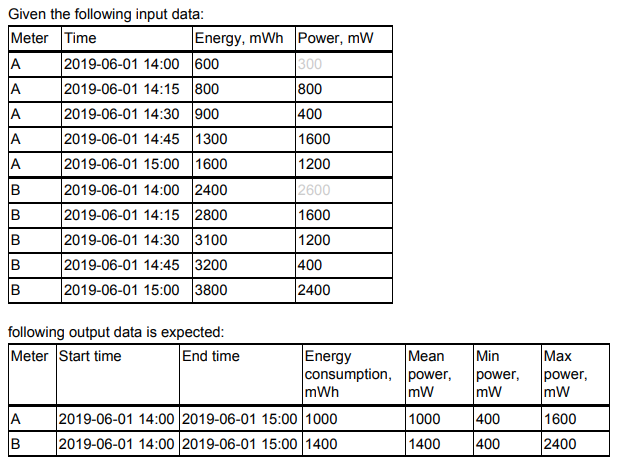

# PySpark EEC data processing Project

this project is built using the following template : 
[pyspark-template-project](https://github.com/AlexIoannides/pyspark-example-project)


## Goal
The goal of this project is to implement an application to process electrical energy consumption
data.

the Sample Data located in the data folder contains historical data energy and power readings collected by EEC meters.
Each line represents an energy and a power reading made by one meter at a given point in time


The application will calculate a few metrics and output the result to a persistent storage. The following metrics will be extracted over 1-hour time windows:
-  Total energy consumption during the hour, in mWh
-  Min, max, and mean power during the hour, in mW

Application is designed to take into account the need scale out the computations. Sample
dataset is given for tests only. Although the sample dataset includes only 100MB of
data, the application should be able,to process high volumes of data. (Think per-second readings from thousands of meters).

## Example of the expected metrics calculation.




## ETL Project Structure

The project structure is as follows:

```bash
root/
 |-- data/
 |   |-- sample/
 |-- dependencies/
 |   |-- logging.py
 |   |-- spark.py
 |-- jobs/
 |   |-- etl_job.py
 |-- tests/
 |   |-- test_data/
 |   |-- | -- expected_output/
 |   |-- | -- input/
 |   |-- test_etl_job.py
 |   build_dependencies.sh
 |   packages.zip
 |   Pipfile
 |   Pipfile.lock
```

The main Python module containing the ETL job (which will be sent to the Spark cluster), is `jobs/etl_job.py`. In the project's root is included `build_dependencies.sh`, which is a bash script for building the dependencies into a zip-file to be sent to the cluster (`packages.zip`). Unit test modules are kept in the `tests` folder and small chunks of representative input and output data, to be used with the tests, are kept in `tests/test_data` folder.

## Structure of the ETL Job

 the 'Transformation' step is isolated from the 'Extract' and 'Load' steps  and return the transformed data as a single DataFrame. Then, the code that surrounds the use of the transformation function in the `main()` job function, is concerned with Extracting the data, passing it to the transformation function and then Loading (or writing) the results to their ultimate destination. 


## Packaging ETL Job Dependencies

In this project, functions that can be used across different ETL jobs are kept in a module called `dependencies` 

As This package, together with any additional dependencies referenced within it, must be copied to each Spark node for all jobs that use `dependencies` to run. This can be achieved with
sending all dependencies as a `zip` archive together with the job, using `--py-files` with Spark submit.

## Running the ETL job

Assuming that the `$SPARK_HOME` environment variable points to your local Spark installation folder, then the ETL job can be run from the project's root directory using the following command from the terminal,

```bash
$SPARK_HOME/bin/spark-submit \
--master local[*] \
--py-files packages.zip \
jobs/etl_job.py
```

Briefly, the options supplied serve the following purposes:

- `--master local[*]` - the address of the Spark cluster to start the job on. If you have a Spark cluster in operation (either in single-executor mode locally, or something larger in the cloud) and want to send the job there, then modify this with the appropriate Spark IP - e.g. `spark://the-clusters-ip-address:7077`;
- `--py-files packages.zip` - archive containing Python dependencies (modules) referenced by the job; and,
- `jobs/etl_job.py` - the Python module file containing the ETL job to execute.

Full details of all possible options can be found [here](http://spark.apache.org/docs/latest/submitting-applications.html).

## Debugging Spark Jobs Using `start_spark`

It is not practical to test and debug Spark jobs by sending them to a cluster using `spark-submit` and examining stack traces for clues on what went wrong.
Therefore `start_spark` function - found in `dependencies/spark.py` - is available to facilitate the development of Spark jobs that are aware of the context in which they are being executed.


## Unit Tests

In order to test with Spark, we use the `pyspark` Python package, which is bundled with the Spark JARs required to programmatically start-up and tear-down a local Spark instance

To execute the example unit test for this project run,

```bash
pipenv run python -m unittest tests/test_*.py
```

## Managing Project Dependencies using Pipenv

[pipenv](https://docs.pipenv.org) is used for managing project dependencies and Python environments (e.g. PySpark, flake8 for code linting, IPython for interactive console sessions, etc.), are described in the `Pipfile`. Their **precise** downstream dependencies are described in `Pipfile.lock`.


### Installing this Projects' Dependencies

Make sure that you're in the project's root directory (the same one in which the `Pipfile` resides), and then run,

```bash
pipenv install --dev
```

This will install all of the direct project dependencies as well as the development dependencies (the latter a consequence of the `--dev` flag).

### Running Python and IPython from the Project's Virtual Environment

In order to continue development in a Python environment that precisely mimics the one the project was initially developed with, use Pipenv from the command line as follows,

```bash
pipenv run python3
```

The `python3` command could just as well be `ipython3`, for example,

```bash
pipenv run ipython
```

This will fire-up an IPython console session *where the default Python 3 kernel includes all of the direct and development project dependencies* - this is our preference.


### Automatic Loading of Environment Variables

Pipenv will automatically pick-up and load any environment variables declared in the `.env` file, located in the package's root directory. For example, adding,

```bash
SPARK_HOME=applications/spark-2.3.1/bin
DEBUG=1
```

Will enable access to these variables within any Python program -e.g. via a call to `os.environ['SPARK_HOME']`. Note, that if any security credentials are placed here, then this file **must** be removed from source control - i.e. add `.env` to the `.gitignore` file to prevent potential security risks.